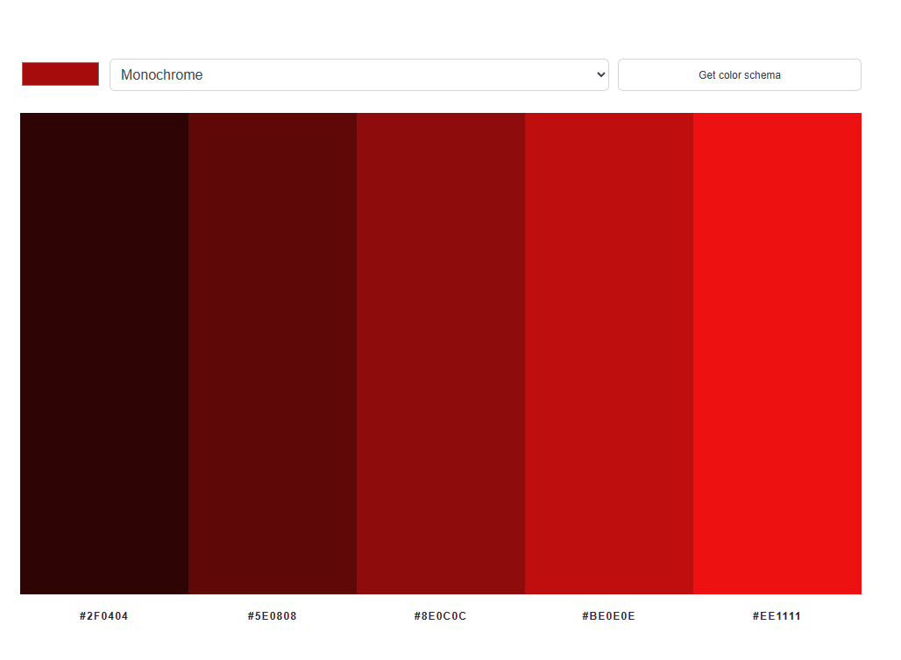
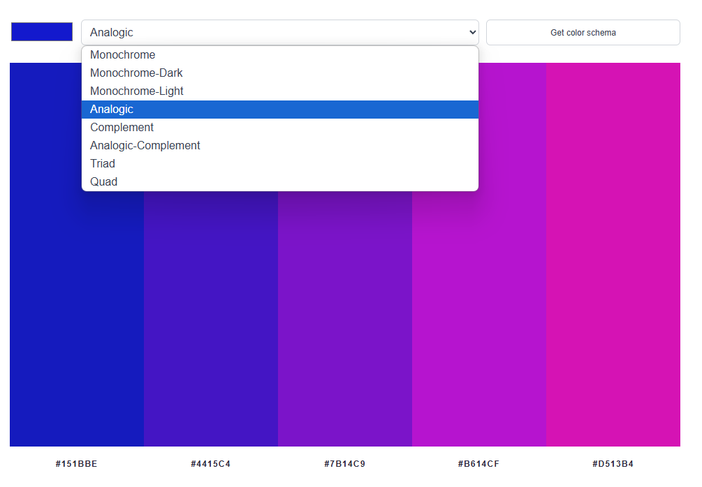
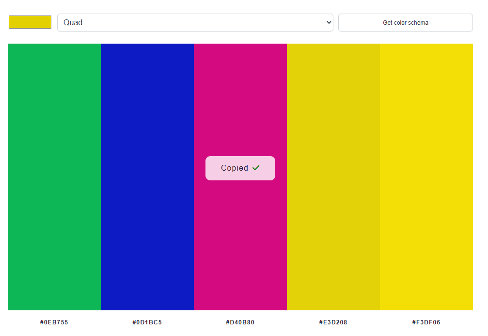

# Color schema generator using The Color API

This is a project from [Scrimba course](https://scrimba.com/frontend-path-c0j). This is a project based on a provided Figma design, fully implemented by me.

### Screenshot

## Table of contents

-   [Screenshot](#screenshot)
-   [Overview](#overview)
    -   [Links](#links)

## Overview

A simple and interactive color palette generator based on a provided Figma design. The project was fully implemented by me using HTML, CSS, and vanilla JavaScript.

Features:

-   Users can choose a base color using a color picker.

-   Select from various color harmony modes (e.g., monochrome, analogic, triad, complement, etc.).

-   The app fetches color schemes from The Color API.

-   Displays the generated color palette with corresponding HEX codes.

-   Clicking on a color or code copies it to the clipboard with a modal confirmation animation.

Technologies:

-   HTML5 & CSS3

-   JavaScript (ES6)

External API:

-   [TheColorAPI](https://www.thecolorapi.com/)

-   Font Awesome icons for UI feedback

### Links

-   Live Site URL: [live site](https://stately-yeot-f49a49.netlify.app/)
